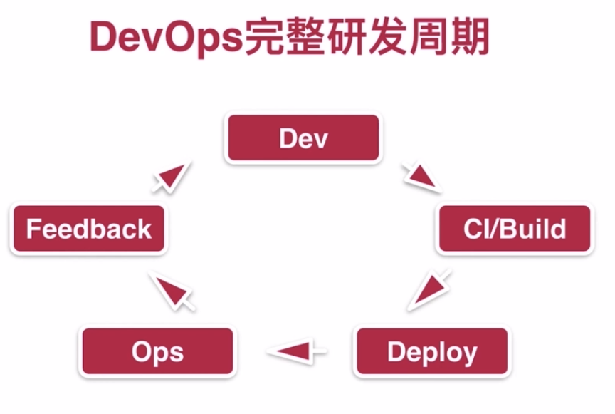

# DevOps 和云计算初识
课程：[DevOps和云计算初识](https://www.imooc.com/learn/910)
### 什么是云计算
- 虚拟化（Virtualization）是基础（计算，存储，网络等）
- 产品服务化（lass,Paas,Saas...Xaas）
- 弹性伸缩，没有边界

### 云计算分类
- 公有云（AWS, 阿里云, Azure等）
- 私有云（Vmware等）
- 混合云（Azure, Rackspace）

### 公有云
- 云服务提供商对基础设施维护
- 多租户
- Pay For Use

### 私有云
- 自己维护云基础设施
- 单租户或狭义上的多租户
- Pay For Cloud

### 混合云（专属云）
- 云服务提供商维护自己的云设施
- 用户范围内租户隔离
- Pay For Use of Cloud

### DevOps
- DevOps = Development + Operations
- 极速的迭代和快速的用户反馈

### DevOps 完整研发周期

