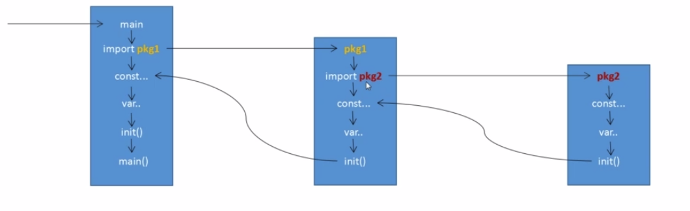
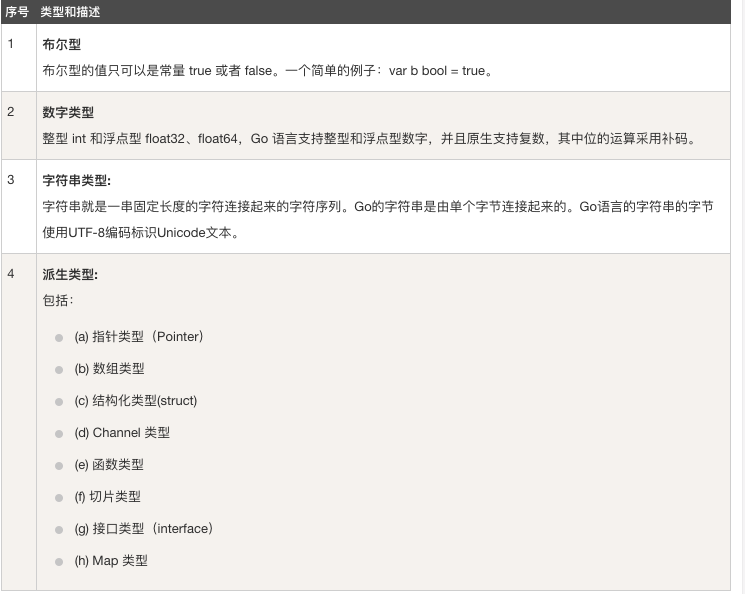

来源：[慕课网课程](https://www.imooc.com/learn/968)
### GO 基础语法
Go 保留的关键字只有25个：

| break | default | func | interface | select |
| :---: | :----: | :--: | :-------: | :----: |
| case | defer | go | map | struct |
| chan | else | goto | package | switch |
| const | fallthrough | if | range | type |
| continue | for | import | return | var |

GO 语言36个预定义标识符，包括基础数据类型和系统内嵌函数：

| append | bool | byte | cap | close | complex |
| :---: | :----: | :--: | :-------: | :----: | :---: |
| complex64 | complex128 | uint16 | copy | false | float32 |
| float64 | imag | int | int8 | int16 | uint32 |
| int32 | int64 | iota | len | make | new |
| nil | panic | uint64 | print | println | real |
| recover | string | TRUE | uint | uint8 | unitprt |

注释形式：
1. `//` 单行注释
2. `/* */` 多行注释

基础语法：
```GO
package main
import "fmt"
const NAME = "name"
var mainName = "main name"
func main()
{
    fmt.Print(mainName)
    fmt.Print(NAME)
}

/*
*  结果输出 name  main name
*/
```

### Go 语言基础结构
```GO
// 程序所属包
package main

// 导入依赖包
import "fmt"

// 常量定义
const NAME string  = "name"

// 全局变量的声明与赋值
var a string  = "name"

// 一般类型声明
type theInt int

// 结构的声明
type Learn struct {
}

// 声明接口
type ILearn interface {
}

// 函数定义
func leanFuc() {
    fmt.Print(a:"learnImooc")
}

// main() 函数
func main() {
    leanFun()
    fmt.Print(a:"Hello world")
}
```

### GO 语言 基础语法 ----- Package
- package 是最基本的分发单位和工程管理中依赖关系的体现
- 每个 Go 语言源代码文件开头都拥有一个 package 声明，表示源码文件所属代码包
- 要生成 Go 语言可执行程序，必须要有 `main` 的 package 包，且必须在该包下有 main() 函数
- 同一个路径下只能存在一个 package ，一个 package 可以拆成多个源文件组成

eg:
```GO
package main
import "fmt"
func main() {
    fmt.Print(a:"hello world")
}
```

### GO 基础语法 ----- import 概念
- import 语句可以导入源代码文件所依赖的 package 包
- 不得导入源代码文件中没有用到的 package ， 否则 GO 语言编译器会报编译错误
- Import 语法格式主要有两种：
1.
```GO
import "package1"
import "package2"
import "package3"
...
```
2.
```GO
import (
    "package1"
    "package2"
    "package3"
)
```

### GO 基础语法 ----- import 原理
- 如果一个 main 导入其他包，包将被顺序导入
- 如果导入的包中依赖其他包（包B），会首先导入B包，然后初始化B包中常量和变量，最后如果B包中有init，会自动执行init()
- 所有包导入完成后才会对 main 中常量和变量进行初始化，然后执行 main 中的 init 函数（如果存在）,最后执行 main 函数
- 如果一个包被导入多次则该包只会被导入一次

流程图：



### GO 基础语法 ----- import 别名 ,".","_"
- 别名操作的含义是：将导入的包命名为另一个容易记忆的别名
- 点 `.` 操作的含义是：点 `.` 标识的包导入后,调用该包中函数时可以省略前缀包名
- 下划线 `_` 操作的含义是：导入该包，但不导入整个包，而是执行该包中的 init 函数，因此无法通过包名来调用包中的其他函数，使用下划线 `_` 操作往往是为了注册包里的引擎，让外部可以方便的使用

### GO ---- 数据类型
- 数值类型，字符串类型和布尔型
- 派生类型
- 类型零值和类型别名
- 类型所占存储大小

[GO 语言数据类型](http://www.runoob.com/go/go-data-types.html)

#### 数字类型


浮点型：


其他数字类型：


