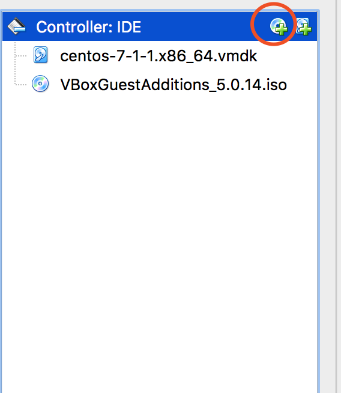
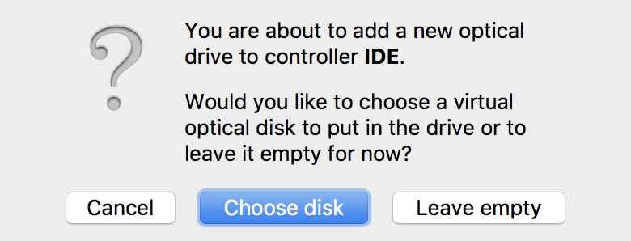
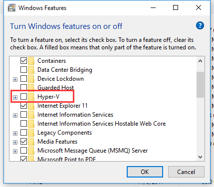

### 如何正确映射`vagrant init `生成的虚拟机目录
搭建环境：mac平台
1. Vagrantfile 修改
```
# Share an additional folder to the guest VM. The first argument is
  # the path on the host to the actual folder. The second argument is
  # the path on the guest to mount the folder. And the optional third
  # argument is a set of non-required options.
  # 尤其下面的部分,一定要是绝对路径，第一项是本机目录，第二项是虚拟机目录,如重启后遇到报错，按照提示进行排查
  config.vm.synced_folder "/Users/youngdee/Code", "/home/vagrant/share/Code",SharedFoldersEnableSymlinksCreate: false

  config.vm.synced_folder "/Users/youngdee/apps", "/home/vagrant/share/apps",SharedFoldersEnableSymlinksCreate: false
```
2. 在 VirtualBox 中挂载 VBoxGuestAdditions 的镜像文件

首先给虚拟机的 `storage` 中挂载一个新的 `CDROM` 并且在弹出的窗口中选择 `leave empty`



- 之后选择直接从虚拟机中安装或者是从官网下载 VBoxGuestAdditions 的镜像挂载到cdrom中
- 挂载完镜像后进入虚拟机主机挂载cdrom并进入
```
# 查看光驱位置
$ lsblk
# 从 dev 中找到我们的 cdrom 并且挂载到虚拟机/media/VBoxGuestAdditions目录中
$ sudo mount /dev/sr0 /media/VBoxGuestAdditions
# 进入目录并运行 
$ sudo VBoxLinuxAdditions.run
# 根据提示安装缺失的组件,之后有关于window system 错误的时候忽略即可
```
> 附：[virtualbox 官方工具下载列表](http://download.virtualbox.org/virtualbox/)

### WINDOWS 启动 vagrant 的时候报错，virtualBox 无法启动虚拟机
关闭 Hyper-V

