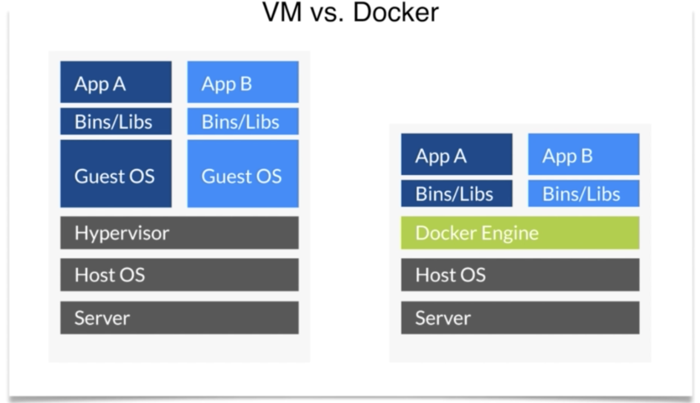
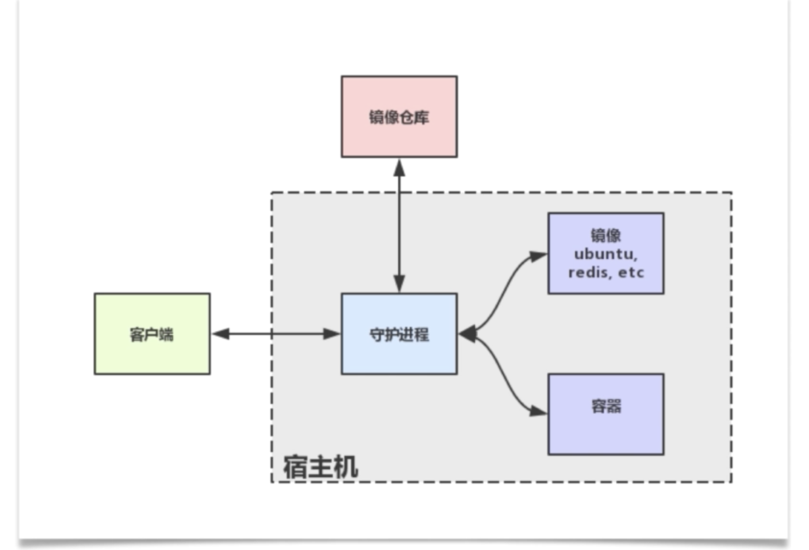
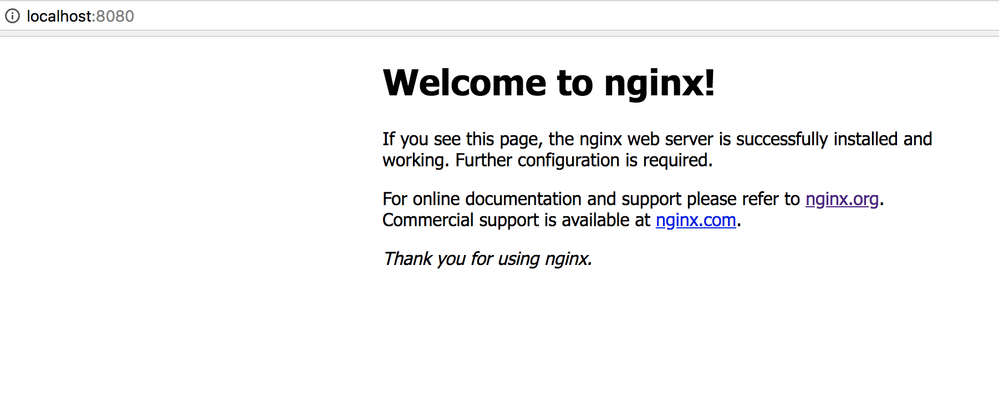
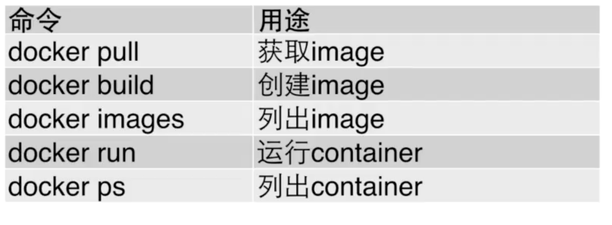
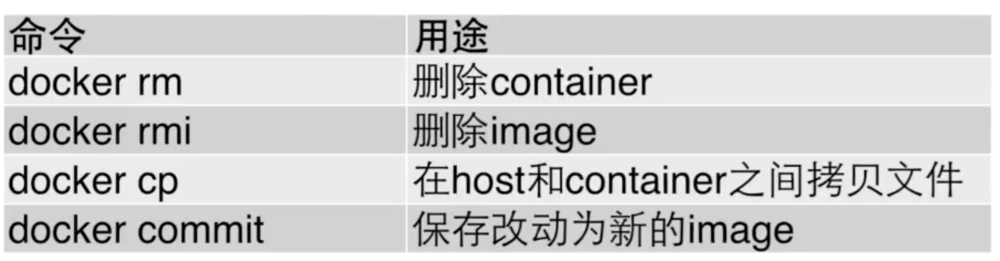
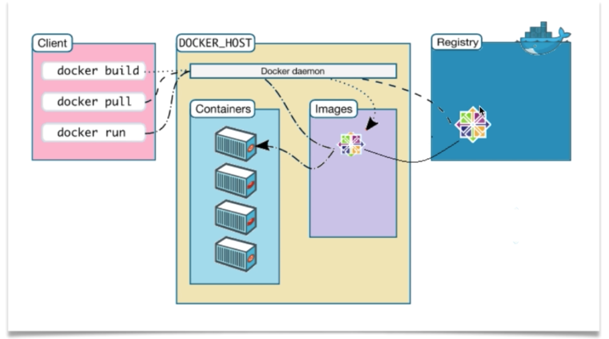
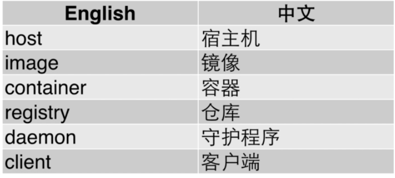

# Docker 入门教程
[Docker入门教程-慕课网](https://www.imooc.com/learn/867)
Docker和虚拟机的区别



### 安装
mac 从官网下载对应版本即可下载
linux 运行 `sudo wget -qO- https://get.docker.com | sh` 来通过shell自动化安装docker,或者利用发行版的安装工具来进行下载
windows 安装和mac一样从官网获取对应安装程序安装即可

### docker 的架构



### docker 服务
```
# service 启动 docker 服务
$ service docker start
# systemctl 命令 启动 docker 服务
systemctl start docker
```

### 用法
```
# 查找官方仓库中的镜像
$ docker search 

# 拉取并运行ubuntu容器
$ docker run ubuntu 

# 查看所有的 image
$ docker images

# 查看当前docker的守护进程中的 container
$ docker ps

# eg1:运行docker 将容器的80端口映射到本地的8080端口 并 -d 作为守护进程进行
$ docker run -p 8080:80 -d daocloud.io/nginx
```

eg1 结果访问浏览器：


```
# 将文件拷贝进指定容器的指定目录( 例：/usr/share/nginx/html )
$ docker cp index.html containerID:/usr/share/nginx/html
# 停止指定容器
$ docker stop containerID
# 可以 docker ps -a 查看所有运行过的docker之后 用如下再次运行
$ docker start containerID
```

注：docker 默认是不会保存容器修改的

```
# 保存修改过的容器(运行完毕之后会产生一个新的image)
$ docker commit -m 'fun' containerID containerName 

# 删除 image 镜像 前提需要关闭相关的容器
$ docker rmi containerID

# 查看运行过的 container 列表
$ docker ps -a

# 删除运行过的 container
$ docker rm containerID


```

docker 拷贝
```
$ docker cp ./ containerID:./
```

用法图表：




### Dockerfile
构建自己的image
```
# 新建 dockerfile 文件 ，并在文件中写入需要创建的内容和运行的项目
# 运行 docker build 来创建项目并打上 tag（假设已经在创建目录中）
 docker build -t xbf/hello-nginx .
```

dockerfile 语法图列


### Volume
提供独立于容器之外的持久化存储
#### 本地目录挂载进容器
1. `$ docker run -d --name nginx -v /usr/share/nginx/html nginx` 挂载容器内部-v后面的路径，本地的映射路径使用`docker inspect containerName`打印信息的 Mounts 的 Source 路径就是本地路径。在mac上，这个路径在一个虚拟层中，所以直接访问是不存在的。mac使用

进入后即可访问Source所示的本地路径。

```
# 进入指定容器
$ docker exec -it containerName /bin/bash
```

2. 直接挂载本地目录进容器
```
# 将本地的路径挂载到容器中的目录，本地路径：容器路径，$PWD/html = 当前路径的html目录
$ docker run -p 80:80 $PWD/html:/usr/share/nginx/html nginx
```

3. volume 挂载进别的容器
```
# 创建容器并挂载 data_container 
$ docker run --volumes-from data_container ubuntu
or
# 创建容器并挂载 data_container 并进入
$ docker run -it  --volumes-from data_container ubuntu /bin/bash
```
用例：比如以一个容器为数据容器被多个容器挂载，就可以实现数据共享

### 镜像仓库(Registry)


术语：


用法：
```
# 搜索镜像
$ docker search whalesay
# 拉取镜像
$ docker pull whalesay
# 推送镜像 需要 docker login 登录 dockerHub 的账号密码
$ docker push myname/whalesay
```


### docker-compose
#### 安装
多容器 app（类似 laradock 就是个多容器的app ）
linux 安装的 docker 需要另外安装 docker-compose 
```
# 从远程拉取二进制文件编译成可执行文件
$ curl -L https://github.com/docker/releases/download/1.9.0/docker-compose-$(uname -S)-$(uname -m) > /usr/local/bin/docker-compose
# 设置所有人都可以执行
$ chmod a+x /usr/local/bin/docker-compose
# 查看 docker-compose 版本
$ docker-compose --version
```

#### 使用


#编程学习/docker
