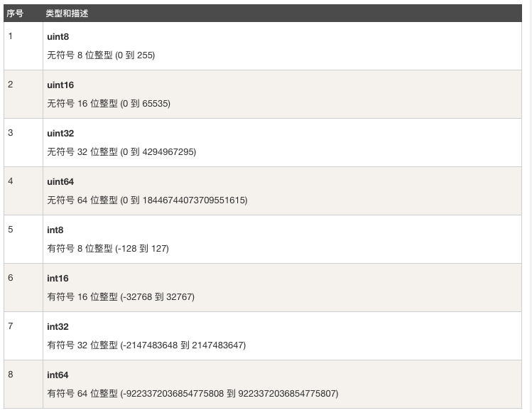
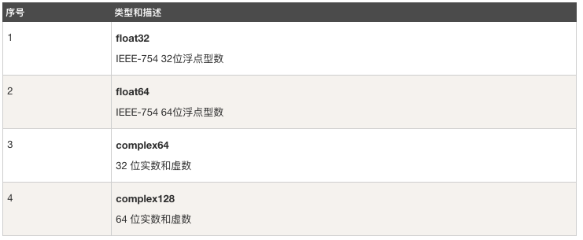
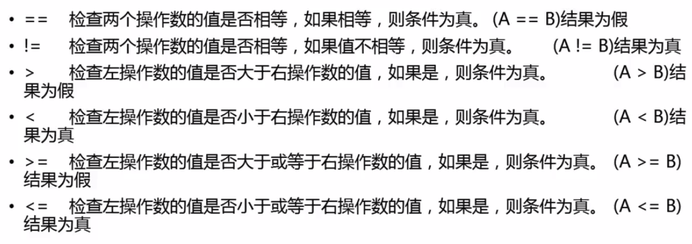
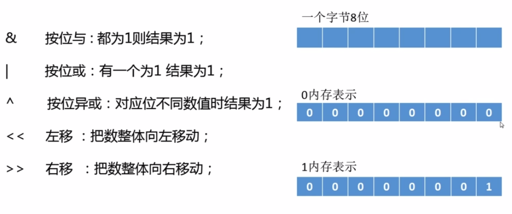
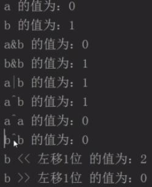
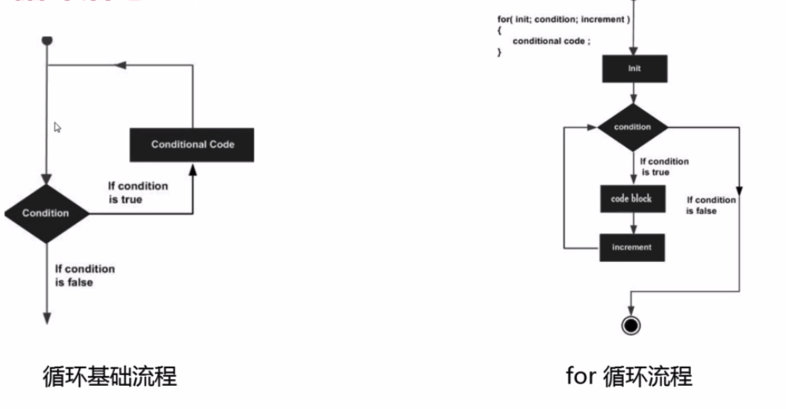

参考：
- [慕课网课程](https://www.imooc.com/learn/968)
- [the way to go](https://github.com/Unknwon/the-way-to-go_ZH_CN)
### GO 基础语法
Go 保留的关键字只有25个：

| break | default | func | interface | select |
| :---: | :----: | :--: | :-------: | :----: |
| case | defer | go | map | struct |
| chan | else | goto | package | switch |
| const | fallthrough | if | range | type |
| continue | for | import | return | var |

GO 语言36个预定义标识符，包括基础数据类型和系统内嵌函数：

| append | bool | byte | cap | close | complex |
| :---: | :----: | :--: | :-------: | :----: | :---: |
| complex64 | complex128 | uint16 | copy | false | float32 |
| float64 | imag | int | int8 | int16 | uint32 |
| int32 | int64 | iota | len | make | new |
| nil | panic | uint64 | print | println | real |
| recover | string | TRUE | uint | uint8 | unitprt |

注释形式：
1. `//` 单行注释
2. `/* */` 多行注释

基础语法：
```GO
package main
import "fmt"
const NAME = "name"
var mainName = "main name"
func main()
{
    fmt.Print(mainName)
    fmt.Print(NAME)
}

/*
*  结果输出 name  main name
*/
```

### Go 语言基础结构
```GO
// 程序所属包
package main

// 导入依赖包
import "fmt"

// 常量定义
const NAME string  = "name"

// 全局变量的声明与赋值
var a string  = "name"

// 一般类型声明
type theInt int

// 结构的声明
type Learn struct {
}

// 声明接口
type ILearn interface {
}

// 函数定义
func leanFuc() {
    fmt.Print(a:"learnImooc")
}

// main() 函数
func main() {
    leanFun()
    fmt.Print(a:"Hello world")
}
```

### GO 语言 基础语法 ----- Package
- package 是最基本的分发单位和工程管理中依赖关系的体现
- 每个 Go 语言源代码文件开头都拥有一个 package 声明，表示源码文件所属代码包
- 要生成 Go 语言可执行程序，必须要有 `main` 的 package 包，且必须在该包下有 main() 函数
- 同一个路径下只能存在一个 package ，一个 package 可以拆成多个源文件组成

eg:
```GO
package main
import "fmt"
func main() {
    fmt.Print(a:"hello world")
}
```

### GO 基础语法 ----- import 概念
- import 语句可以导入源代码文件所依赖的 package 包
- 不得导入源代码文件中没有用到的 package ， 否则 GO 语言编译器会报编译错误
- Import 语法格式主要有两种：
1.
```GO
import "package1"
import "package2"
import "package3"
...
```
2.
```GO
import (
    "package1"
    "package2"
    "package3"
)
```

### GO 基础语法 ----- import 原理
- 如果一个 main 导入其他包，包将被顺序导入
- 如果导入的包中依赖其他包（包B），会首先导入B包，然后初始化B包中常量和变量，最后如果B包中有init，会自动执行init()
- 所有包导入完成后才会对 main 中常量和变量进行初始化，然后执行 main 中的 init 函数（如果存在）,最后执行 main 函数
- 如果一个包被导入多次则该包只会被导入一次

流程图：


### GO 基础语法 ----- import 别名 ,".","_"
- 别名操作的含义是：将导入的包命名为另一个容易记忆的别名
- 点 `.` 操作的含义是：点 `.` 标识的包导入后,调用该包中函数时可以省略前缀包名
- 下划线 `_` 操作的含义是：导入该包，但不导入整个包，而是执行该包中的 init 函数，因此无法通过包名来调用包中的其他函数，使用下划线 `_` 操作往往是为了注册包里的引擎，让外部可以方便的使用

### GO ---- 数据类型
- 数值类型，字符串类型和布尔型
- 派生类型
- 类型零值和类型别名
- 类型所占存储大小

[GO 语言数据类型](http://www.runoob.com/go/go-data-types.html)


#### 数字类型


浮点型：



其他数字类型：


Go 中不允许不同类型之间的混合使用，但是对于常量的类型限制非常少，因此允许常量之间的混合使用。
```GO
package main

func main() {
	var a int
	var b int32
	a = 15
	b = a + a	 // 编译错误
	b = b + 5    // 因为 5 是常量，所以可以通过编译
}
```

```GO
package main

import "fmt"

func main() {
	var n int16 = 34
	var m int32
	// compiler error: cannot use n (type int16) as type int32 in assignment
	//m = n
	m = int32(n)

	fmt.Printf("32 bit int is: %d\n", m)
	fmt.Printf("16 bit int is: %d\n", n)
}
/*
32 bit int is: 34
16 bit int is: 34
*/
```
### 格式化说明符
在格式化字符串里，`%d` 用于格式化整数（`%x` 和 `%X` 用于格式化 16 进制表示的数字）,`%g` 用于格式化浮点型 (`%f` 输出浮点数，`%e` 输出科学计数表示法)，`%0d` 用于规定输出定长的整数，其中开头的数字 0 是必须的。

`%n.mg` 用于表示数字 n 并精确到小数点后 m 位，出了使用 g 之外，还可以使用 e 或者 f，例如格式化字符串 `%5.2e` 来输出 3.4 的结果为 `3.40e+00`


### GO ----- 类型零值和类型别名
- 类型零值不是空值，而是某个变量被声明后的默认值，一般情况下，默认型的默认值为`0`，布尔型默认值为`false`，string默认值为 空字符串
- 我们可以对类型设置别名

### GO 数据类型 ----- 类型存储大小 


### GO ----- 变量
- 单个变量声明和赋值
    1. 变量的声明格式：var <变量名称> [变量类型]
    2. 变量的赋值格式：<变量名称> = <值，表达式，函数等>
    3. 声明和赋值同时进行：var <变量名称> [变量类型] = <值，表达式，函数等>
    4. 分组声明格(枚举)：
    ```GO
    var (
        i int
        j float32
        name string
    )
    ```
- 同一行声明多个变量和赋值：var a,b,c int =1,2,3 或者 a,b : =1,2
- 全局变量的声明必须使用var关键词，局部变量则可以省略
- 特殊变量下划线 "_"（匿名变量）

- GO 中不存在隐式转换，类型转换必须是显式的
- 类型转换只能发生在两种兼容类型之间
- 类型转换格式：<变量名称> [:]= <目标名称>(<需要转换的变量>)

- 大写字母开头的变量是可导出的，也就是其他包可以读取的，是公用变量
- 小写字母开头的就是不可导出的，是私有变量

> 当一个变量被声明之后，系统自动赋予它该类型的零值： int 为 0，float 为 0.0，bool 为 false，string 为空字符串，指针为nil。所有内存在 Go 中都是经过初始化的。

> 一个变量（常量，类型或函数）在程序中都有一定的作用范围，称之为**作用域**。如果一个变量在函数体外声明，则被认为是全局变量。可以在整个包甚至外部包(变量首字母大写，被导出后)使用，不管你声明在哪个源文件里或在哪个源文件里调用该变量。

尽管变量的标识符(变量名)必须是唯一的，但是你可以在某个代码块的内层代码块中使用相同名称的变量，则此时外部的同名变量将会暂时隐藏（结束内存代码块的执行后隐藏的外部同名变量又会出现，而内部同名变量则被释放）,你任何的操作都只会影响内部代码块的局部变量。
```GO
package main

var a = "G"

func main() {
   n()
   m()
   n()
}

func n() { print(a) }

func m() {
   a := "O"
   print(a)
}

/*
GOG
*/
```

```GO
package main

var a = "G"

func main() {
   n()
   m()
   n()
}

func n() {
   print(a)
}

func m() {
   a = "O"
   print(a)
}

/*
GOO
*/
```

```GO
package main

var a string

func main() {
   a = "G"
   print(a)
   f1()
}

func f1() {
   a := "O"
   print(a)
   f2()
}

func f2() {
   print(a)
}

/*
GOG
*/
```

> 局部变量声明赋值后要被使用，不然会报错，但是全局变量是允许声明但不使用。

同一类型的多个变量可以声明在同一行:
```GO
var a,b,c int
```

多变量可以在同一行赋值:
1. 已被提前声明的变量
```GO
a, b, c = 5,7,"abc"
```
2. 没被提前声明的变量
```GO
a, b, c := 5,7,"abc"
```
右边的值会以相同的顺序给左边的变量
> 空白标识符 `_` 也被用于抛弃值，`_.b = 5,7`中 5 被抛弃

> 变量出了可以在全局声明中初始化，也可以在 `init` 函数中初始化。这是一类非常特殊的函数，它不能够被人为调用，而是在每个包完成初始化后自动执行，并且执行优先级比 main 函数高。<br>
每个源文件都只能包含一个 `init` 函数，初始化总是以单线程执行，并且按照包的依赖关系顺序执行。<br>
一个可能的用途是在开始执行程序之前对数据进行校验或修复，以保证程序状态的正确性


### GO ----- 常量
- 常量定义从形式上可分为显式和隐式：
    - 显式：const identifier [type] = value
    - 隐式：const identifier = value (通常叫无类型常量,**未定义类型的常量会在必要的时刻根据上下文来获取相关类型**)
- 常量可以使用内置表达式定义，例如：len(),unsafe.Sizeof() 等
- 常量范围目前只支持布尔型，数字型（整数型，浮点型和复数）和字符串型
> 常量的值必须是能够在编译时就能够定的；可以在赋值表达式中涉及计算过程，但是所有用于计算的值必须在编译期间就能获得。
因为在编译期间自定义函数均属于未知，因此无法用于常量的赋值，但内置函数可以使用,如: len() 。

`\` 反斜杠可以在常量表达式中作为多行的连接符使用。

常量枚举：
```GO
const (
    Unknown = 0
    Female = 1 
    Male = 2 
)
```


### 特殊常量 iota 
- iota 在 const 关键字出现时将被重置为 0
- const 中每**新增一行**常量声明将使 iota 计数一次
- iota 常见使用法
  1. 跳值使用法
  2. 插队使用法
  3. 表达式隐式使用法
  4. 单行使用法

> 在每遇到一个新的常量块或单个常量声明时，`inta` 都会重置为0 (简单的讲，每遇到一次 `const` 关键字，iota 就重置为 0。在枚举中连续声明的枚举值 `iota` 会正常递增)

跳值的使用：
```GO
package main
import "fmt"
const(
    a = iota
    b = iota
    _
    _
    c = iota
)
func main(){
    fmt.Println("a的常量值为：")
    fmt.Println(a)
    fmt.Println("b的常量值为：")
    fmt.Println(b)
    fmt.Println("c的常量值为：")
    fmt.Println(c)
}

/*
a的常量值为：
0
b的常量值为：
1
c的常量值为：
3
*/
```

### 算数运算符
- `+` 添加两个操作数 `A+B`
- `-` 从第一个操作数中减去第二个操作数 `A-B`
- `*` 将两个操作数相乘 `A*B`
- `/` 将分子除以坟墓 `B/A`
- `%` 模数运算符，整数除法的余数 `B%A`
- `++` 增加(递增)运算符，将整数值加一 `A++` (只能放在后面++)
- `--` 相减(递减)运算符，将整数值减一 `A--` (只能放在后面--)

### 关系运算符
跟别的语言差不多...


### 逻辑运算符
跟别的语言差不多...


### 按位运算符




### 赋值运算符


## 控制语句
- 条件语句 `if`,`if...else`,嵌套 `if`，`else if`
- 选择语句 `switch` ,`select` ;
- 循环语句 `for` (没有`foreach`)
- 控制语句中使用到的关键字 `goto`,`break`,`continue`

### 条件语句
嵌套使用
```GO
package main

import(
    "fmt"
)

func main(){
    a := 0
    if a>1{
        fmt.Print("a是大于1的")
        fmt.Print("\n")
        if a<4 {
            fmt.Print("a是小于4的")
        }
    }else if a<1{
        fmt.Print("a是小于1的")
    }
}
```

### 选择语句

```GO
package main

import(
    "fmt"
)

func main(){
        a := 5
        switch a{
            case 1:
                fmt.Print("变量等于1")
            case 2:
                fmt.Print("变量等于2")
            case 3:
                fmt.Print("变量等于3")
            default:
                fmt.Print("都不满足")
        }
}
```

### 循环语句

```GO
package main

import(
    "fmt"
)

func main(){
    for i:=1;i<10;i++{
        fmt.Print("GOGOGO")
        fmt.Print(i)
        fmt.Print("\n")
    }
}

/*
GOGOGO1
GOGOGO2
GOGOGO3
GOGOGO4
GOGOGO5
GOGOGO6
GOGOGO7
GOGOGO8
GOGOGO9
*/
```

```GO
package main

import(
    "fmt"
)

func main(){

    a := []string{"香蕉","苹果","雪梨"}
    // 这里的 _ 代替了 key，如果要输出 key 替换 _ 为变量名即可
    for _,value:=range a{
        fmt.Print("value的值为：")
        fmt.Print(value)
        fmt.Print("\n")
    }

}
 
/*
value的值为：香蕉
value的值为：苹果
value的值为：雪梨
*/
```

### 控制语句


goto
```GO
package main

import(
    "fmt"
)

func main(){

    goto One
    fmt.Print("中间代码块")
    One:
        fmt.Print("这里是代码块一")

}

/*
这里是代码块一
*/
```
Happly Hacking...

