# Nginx 学习
[Nginx从入门到实践_Nginx中间件-慕课网实战](https://coding.imooc.com/class/121.html)

## 准备：
关闭了iptables 关闭了selinux
关闭iptables :
```
# 查看当前 iptables 规则
$ iptables -L
# 关闭所有 iptablis 规则
$ iptables -F
# 查看具体的 iptables 信息
$ iptable -t nat -L
``` 

关闭selinux
```
# 查看当前是否开启了selinux
$ getenforce 
# 关闭 selinux 
$ setenforce 0
```

## 基础篇
### Nginx 的中间件架构
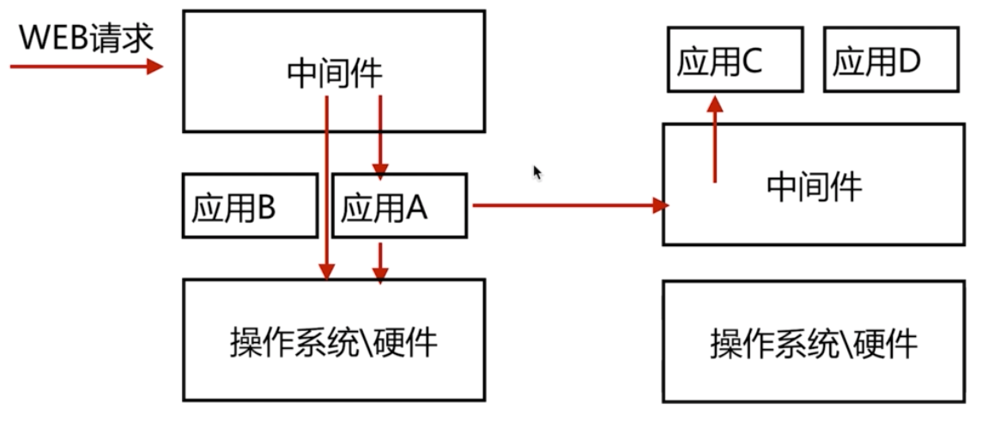

### Nginx 简述
Nginx 是一个开源且高性能，可靠的HTTP中间件，代理服务。

### 常见的HTTP服务
HTTPD - Apache 基金会
IIS - 微软
GWS - Google （不开放）

### Nginx 优点

#### 1. IO 多路复用
IO 多路复用 epoll（IO复用用来解决并发问题，并行处理，串行处理）
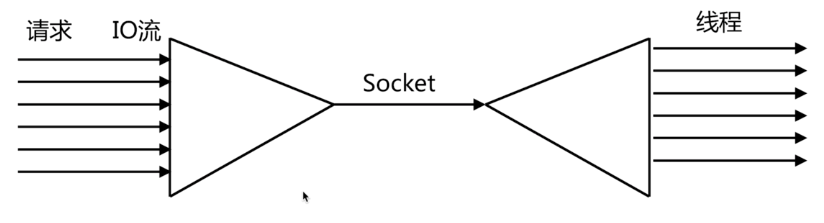

串行处理偏向于一对一处理，挨个处理（一对多）
多线程处理，多个程序多个处理（多对多）

IO多路复用：
多个描述符 I/O 操作都能在一个线程内并发交替地顺序完成，这就叫 I/O 多路复用，这里的 “复用” 指的是复用同一个线程。

IO 多路复用的实现方式：
select , poll , epoll

Nginx 采用的 epoll 模型

#### 2. 轻量级
功能模块少
代码模块化
（功能上可能没有apache丰富）

#### 3. CPU 亲和（affinity）
什么是 cpu 亲和？
是一种把 CPU 核心和 Nginx 工作进程绑定方式，把每个 worker 进程固定在一个 cpu 上执行，减少切换 cpu 的 cache miss，获得更好的性能。

### 4. sendfile
一般的 http server 文件请求会从内核空间再到用户空间，用户空间再到内核空间传递到socket

senfile 只把文件请求通过内核空间 分配给 socket

静态文件处理上 nginx 的效率会高很多

### 安装Nginx
版本分支：
Mainline version - 开发版

Stable version  - 稳定版

Legacy version - 历史版本

具体参考官网：[nginx news](http://nginx.org/)
版本包旁边的 PGP 链接用于安全校验

在`/etc/yum.repos.d/`创建 .repo（nginx.repo） 添加yum源文件（centos）

### Nginx 基础
#### Nginx 目录
`$ rpm -ql nginx` rpm包安装的nginx服务项目列表

`/etc/logrotate.d/nginx` Nginx 日志轮转配置文件，用于 logrotate 服务的日志切割

```
/etc/nginx
/etc/nginx/nginx.conf
/etc/nginx/conf.d
/etc/nginx/conf.d/default.conf
```
Nginx 主配置文件目录，配置文件

```shell
/etc/nginx/fastcgi_params
/etc/nginx/uwsgi_params
/etc/nginx/scgi_params
```
cgi配置相关，fastcgi 配置 文件

```shell
/etc/nginx/koi-utf
/etc/nginx/koi-win
/etc/nginx/win-utf
```
编码转换映射转化文件

`/etc/nginx/mime.types`设置 http 协议的 Content-Type 与扩展名对应关系 

```shell
/usr/lib/systemd/system/nginx-debug.service
/usr/lib/systemd/system/nginx.service
/etc/sysconfig/nginx
/etc/sysconfig/nginx-debug
```
用于配置出系统守护进程管理器管理方式

```shell
/usr/lib64/nginx/modules
/etc/nginx/modules
```
Nginx 模块目录

```shell
/usr/sbin/nginx
/usr/sbin/nginx-debug
```
Nginx 服务的启动管理的终端命令

```shell
/usr/share/doc/nginx-1.12.2
/usr/share/doc/nginx-1.12.2/COPYRIGHT
/usr/share/man/man8/nginx.8.gz
```
Nginx 的手册和帮助文件

```shell
/var/cache/nginx
```
Nginx 的缓存目录

```shell
/var/log/nginx
```
Nginx 的日志目录

#### Nginx 语法配置
`nginx -V`查看nginx的具体信息包括编译参数

`nginx -v`查看nginx的版本

安装编译参数

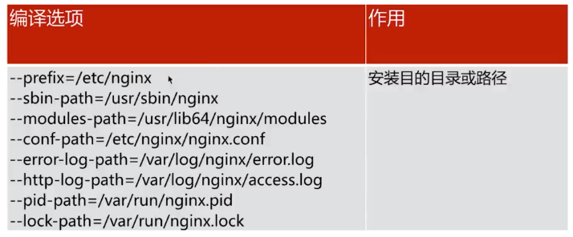

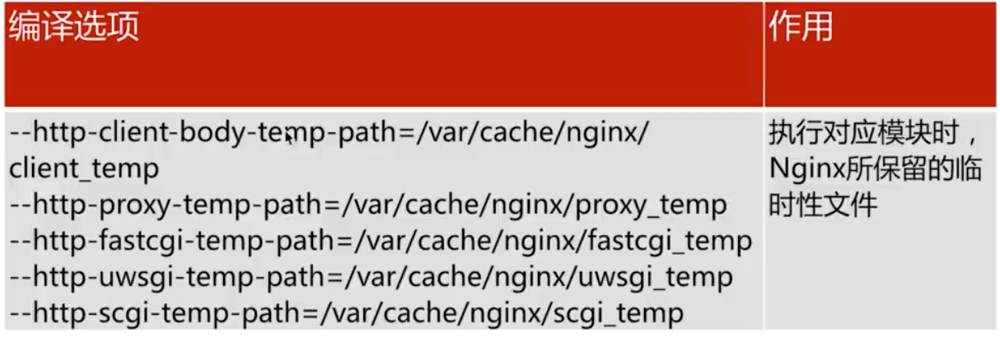

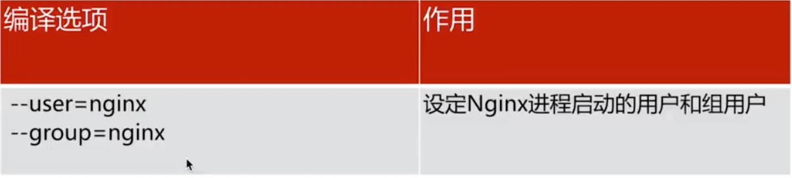

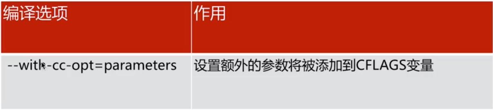

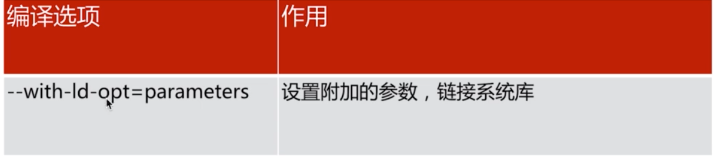

/etc/nginx/nginx.conf (默认配置):

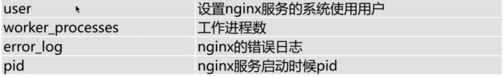


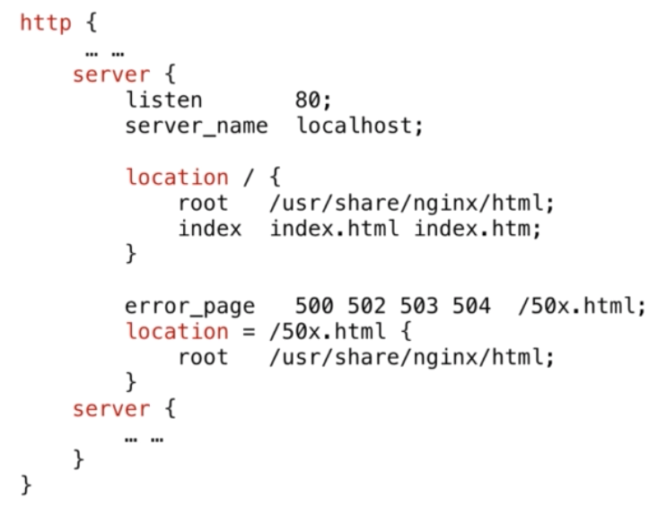

Tip：可以在 error_page 配置中配置更多的错误类型，例如 404 共同使用同一个错误页面，错误页面的路径配置在 location 中定义  

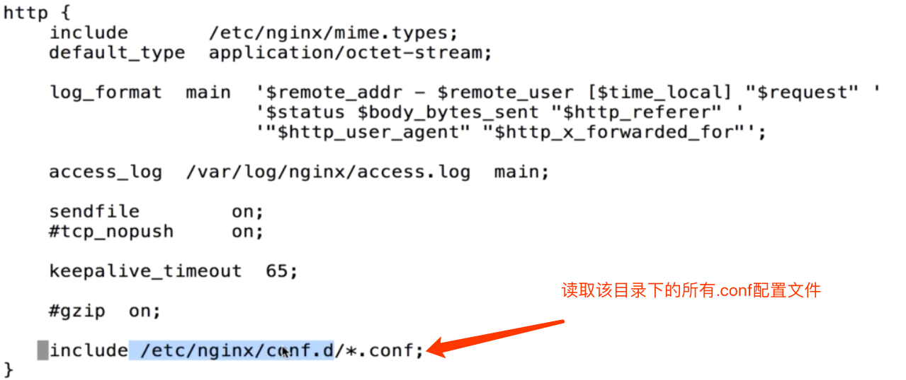

一个http有多个 server 一个server 有多个location

### HTTP 请求


request - 包含请求行，请求头部，请求数据

response - 包括状态航，消息报头，相应正文

在curl 中展示request 和 response 信息
```
$ curl -v https://localhost > /dev/null
```
或者
在浏览器的开发者工具中的网络部分查看请求的相关信息数据。

### Nginx 日志类型
默认的日志文件和目录位置

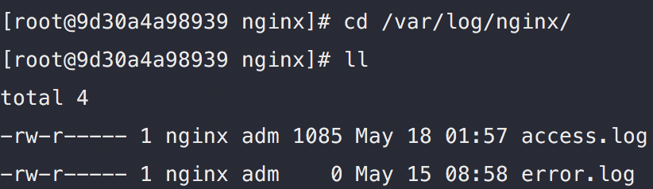

上面的位置也可以根据 /etc/nginx/nginx.conf 文件中定义的路径来查找：

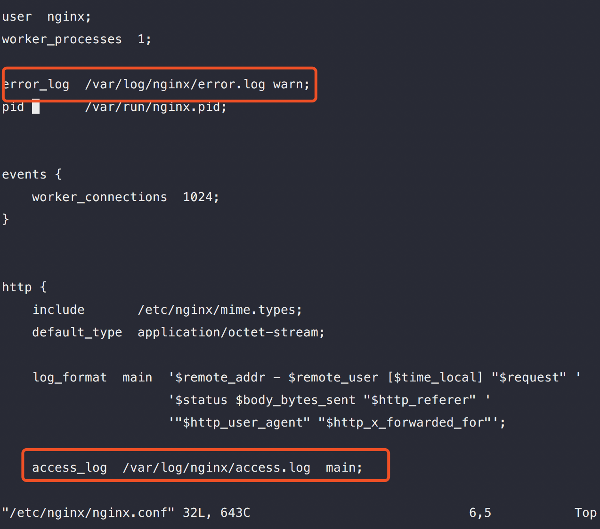
`error_log` 配置后面的 warn 代表记录的错误的错误级别。

`access_log` 配置后面的 main 代表 `log_format` 声明的 `main`格式来进行记录 

`error.log`   -   主要记录 nginx http 请求错误和 nginx 错误的状态

`access_log` - 记录 nginx 请求的访问状态
日志实现基于 log_format 配置：

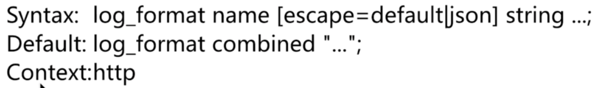

Nginx 变量：
* HTTP 请求变量  - arg_PARAMETER , http_HEADER , sent_http_HEADER 
* 内置变量 - Nginx 内置的
* 自定义变量 - 自己定义

具体的 log 内置变量也可参考：
[Logging to syslog](http://nginx.org/en/docs/syslog.html)

access_log: http://nginx.org/en/docs/http/ngx_http_log_module.html#access_log

### Nginx 模块
模块分类：
* Nginx 官方模块
* 第三方模块

Tip:  nginx -V 查看具体的nginx信息
#### 典型模块


使用如上模块功能可以编辑 conf.d 目录下的配置文件添加一条 location：
```
location /mystatus {
    stub_status;
}
```

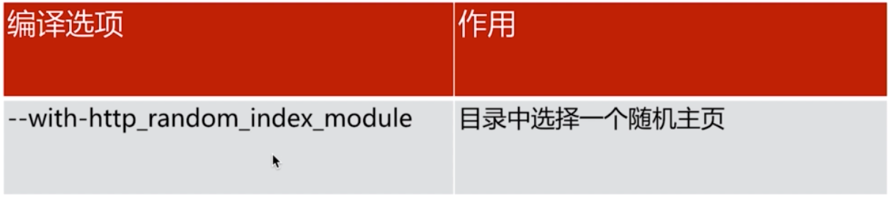
```
# 模块的语法项目
Syntax: random_index on | off;
Default: random_index off;
Context: location

eg(随机/opt/app/code 下的.html文件):
location / {
     #root   /usr/share/nginx/html;
     root /opt/app/code;
     random_index on;
     #index  index.html index.htm;
 }
```


```
# 模块的典型语法
Syntax: sub_filter string replacement;
Default: ---
Context: http,server,location

Syntax: sub_filter_last_modified  on | off;
Default: sub_filiter_last_modified off;
Content: http,server,location

Syntax: sub_filter_once on|off;
Default: sub_filter_once on;
Context: http,server,location

eg(替换返回给用户的请求中的字符串)：
location / {
	  root /opt/app/code;
	  index index.html index.html
	  sub_filter '<a>imooc' '<a>IMOOC'; # 替换语句 第一个参数项是匹配的字符串，第二个是要替换的字符串。
	  sub_filter_once off; # 关闭后替换全部匹配的字符 
}
```

### Nginx 的请求限制
* 连接频率限制  - limit_conn_module
* 请求频率限制  - limit_req_module


HTTP 协议建立在 TCP 协议之上，先要进行 TCP 的三次握手。

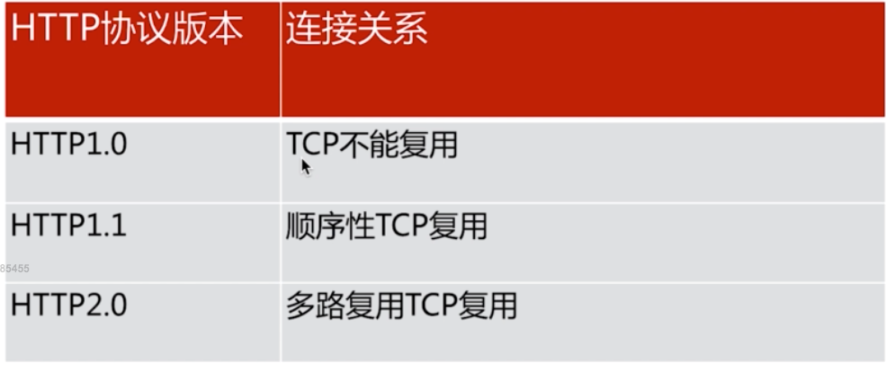
```
# 连接限制
Syntax: limit_conn_zone key zone=name:size;
Default: ---
Context:http

Syntax: limit_conn zone number;
Default: ---
Context: http,server,location

# 请求限制
Syntax: limit_req_zone key zone=name:size rate=rate;
Default: ---
Context:http

Syntax: limit_req zone=name [burst=number][nodelay]
Default: ---
Context:http,server,location
```
eg：
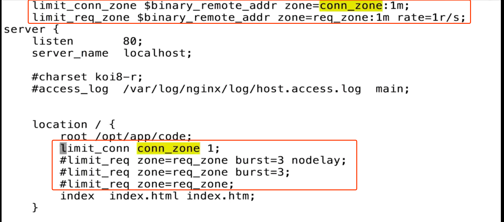


### Nginx 的访问控制
* 基于 IP 的访问控制 - http_access_module

* 基于用户的信任登陆 - http_auth_basic_module

#### http_access_module
```
# http_access_module
Syntax: allow address | CIDR | unix: | all;
Default: ---
Context: http,server,location,limit_except

Syntax: deny address | CIDR | unix: | all;
Default: ---
Context:http,server,location,limit_except

# 
```
eg:
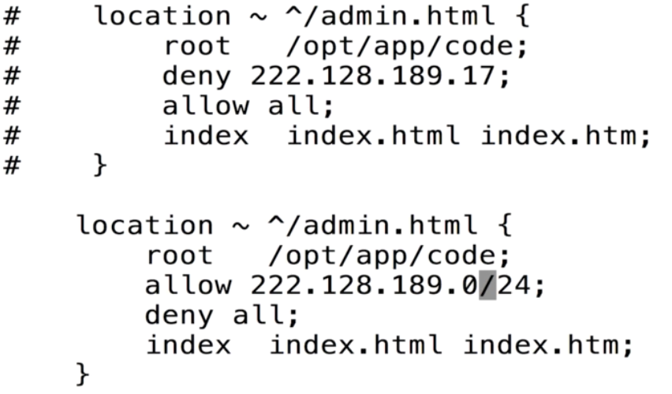

原理（remote_addr 变量是请求的ip）：

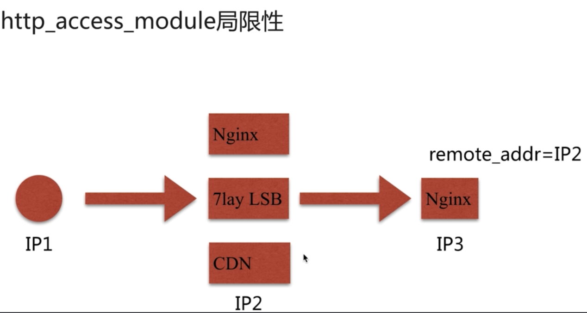

（只能通过 $remote_addr 控制信任，不是很准确容易产生问题或者绕过验证）

另一种方案：

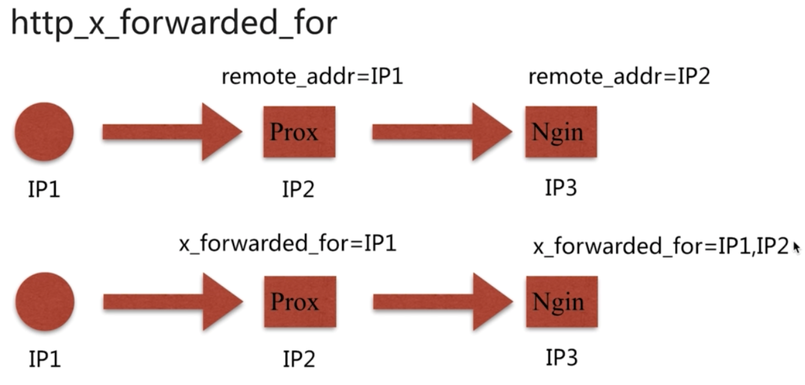
```
# http_x_forwarded_for(可以被修改)
http_x_forwarded_for = Client IP,Proxy(1) IP,Proxy(2) IP,..
```

解决 http_access_module 局限性
1. 采用别的HTTP头信息控制访问，如： HTTP_X_FORWARD_FOR
2. 结合geo模操作
3. 通过HTTP自定义变量传递

#### http_auth_basic_module
```
#http_auth_basic_module
Syntax: auth_basic string | off;
Default: auto_basic off;
Context: http,server,location,limit_except

Syntax: auth_basic_user_file file;
Default: ---
Context: http,server,location,limit_except
```
用法：
```
# 生成密码文件
$ htpasswd -c ./auth_conf youngdee
New password: ...
Re-type new password:...

```
局限性：
1. 用于信息依赖文件方式
2. 操作管理机械，效率低下
解决方案：
1. Nginx 结合 LUA 实现高效验证
2. Nginx 和 LDAP 打通，利用 nginx-auth-ldap 模块（yum或者apt安装的包没有带这个模块）


### FROM: MyBear
材料：学习所用环境来自 [自建docker](https://github.com/gunarua/test-build-dockerfile)